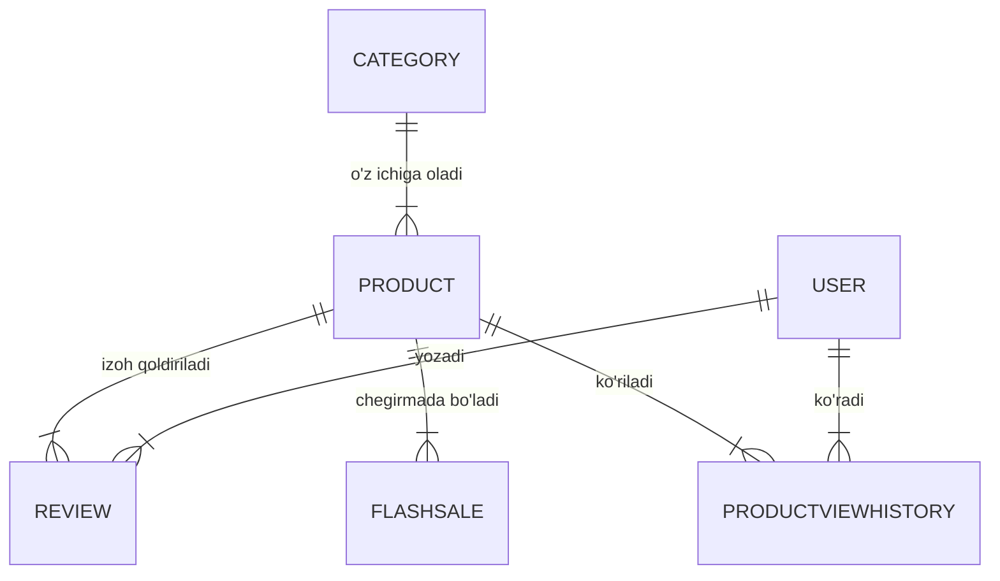

# 🛍️ SHOP API (E-Commerce Backend)

Bu loyiha **Django** va **Django REST Framework (DRF)** yordamida ishlab chiqilgan to'liq funksional elektron tijorat (E-Commerce) API tizimidir. 

Loyiha professional darajada yozilgan bo'lib, unda DRF ning turli xil arxitekturalari (**ViewSets, Generic Views, APIView**) qo'llanilgan. Tizim xavfsizligi **JWT (JSON Web Token)** orqali ta'minlanadi va katta hajmdagi ma'lumotlar bilan ishlash uchun **Pagination, Filtering va Searching** tizimlari mavjud.

---

## 🚀 Texnologiyalar (Tech Stack)

* **Python** 3.x
* **Django** 4.x / 5.x
* **Django REST Framework** (DRF)
* **JWT Authentication** (Simple JWT)
* **Django Filter** (Advanced Filtering)
* **Database:** SQLite (Default) / PostgreSQL

---

## ✨ Asosiy Imkoniyatlar (Features)

Loyihada backend arxitekturasining eng yaxshi amaliyotlari qo'llanilgan:

### 1. Views Arxitekturasi
* **ViewSets (`ModelViewSet`):** Asosiy CRUD amallari uchun (Category, Product).
* **Generic Views (`ListCreateAPIView`, `RetrieveUpdate...`):** Aniq maqsadli endpointlar uchun.
* **APIView:** Maxsus biznes logika va murakkab so'rovlar uchun.

### 2. Ma'lumotlarni Boshqarish
* **🔍 Search & Filter:** Mahsulotlarni nomi, narx oralig'i va kategoriyasi bo'yicha qidirish.
* **📄 Pagination:** Ma'lumotlarni sahifalab (page-by-page) uzatish.
* **⚡ Flash Sales:** Vaqt bilan cheklangan maxsus chegirmalar tizimi.
* **📊 Analytics:** Foydalanuvchilarning ko'rish tarixi (`ProductViewHistory`).

### 3. Xavfsizlik
* **🔐 JWT Auth:** Tizimga xavfsiz kirish va token orqali so'rovlarni himoya qilish.
* **Permissions:** Admin va oddiy foydalanuvchi huquqlarini ajratish.

---

## 🗂 Ma'lumotlar Bazasi Tuzilishi (ER Diagram)

Loyihaning ma'lumotlar bazasi quyidagi bog'liqliklarga ega:



1. Loyihani yuklab olish:
```
git clone [https://github.com/SardorToirov/Shop-api.git]
cd shop-api
```
2. Kutubxonalarni o'rnatish:

```
pip install -r requirements.txt
```

3. Migratsiyalarni amalga oshirish:

```
python manage.py makemigrations
python manage.py migrate
```

4. Serverni ishga tushirish:

```
python manage.py runserver
```
