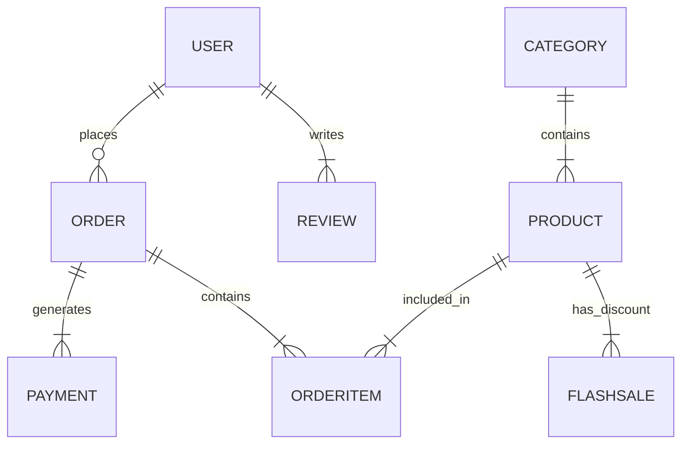

# 🛍️ SHOP API (E-Commerce Backend)

Bu loyiha **Django REST Framework (DRF)** asosida qurilgan, zamonaviy va yuqori yuklamaga mo'ljallangan elektron tijorat tizimidir.

Loyiha nafaqat CRUD amallarini, balki **Asinxron vazifalar (Celery)**, **Telegram Bot integratsiyasi**, **To'lov tizimlari (Billing)** va **Docker** konteynerizatsiyasini to'liq qamrab oladi.

---

## 🛠 Texnologiyalar Steki (Tech Stack)

Loyiha quyidagi ilg'or texnologiyalar asosida ishlaydi:

* **Core:** Python 3.10+, Django 4.x, DRF.
* **Database:** PostgreSQL.
* **Auth:** JWT (JSON Web Token).
* **Async Tasks:** **Celery** (Orqa fon vazifalari uchun).
* **Message Broker:** **Redis** yoki **RabbitMQ** (Celery uchun).
* **Caching:** Redis.
* **Integration:** **Telegram Bot API** (Buyurtmalar haqida xabar berish).
* **Billing:** Stripe / Payme / Click (To'lov integratsiyasi).
* **DevOps:** **Docker** & **Docker Compose**.

---

## ✨ Asosiy Imkoniyatlar (Features)

### 1. 🏗 Backend Arxitekturasi
* **ViewSet & Generics:** Kodning ixchamligi va qayta ishlatilishi uchun.
* **Search & Filter:** `django-filter` yordamida murakkab qidiruv tizimi.
* **Pagination:** Katta hajmdagi ma'lumotlarni optimallashtirilgan holda uzatish.

### 2. ⚡ Asinxron Vazifalar (Celery & Redis)
* **Email Sending:** Ro'yxatdan o'tish va parolni tiklash xatlarini orqa fonda yuborish (sayt qotib qolmaydi).
* **Scheduled Tasks:** "Flash Sale" vaqtlarini avtomatik tekshirish va o'chirish.

### 3. 🤖 Telegram Bot Integratsiyasi
* Foydalanuvchi buyurtma berganda, admin yoki kuryerga **Telegram orqali darhol xabar** boradi.
* Bot orqali buyurtma holatini o'zgartirish imkoniyati.

### 4. 💳 Billing va To'lovlar
* To'lov tizimlari integratsiyasi (Payment Gateway).
* Tranzaksiyalar tarixi va xavfsiz to'lovni tasdiqlash.

---

## 🗂 Ma'lumotlar Bazasi (ER Diagram)


1. Loyihani yuklab olish:
```
git clone [https://github.com/SardorToirov/Shop-api.git]
cd shop-api
```
2. Kutubxonalarni o'rnatish:

```
pip install -r requirements.txt
```

3. Migratsiyalarni amalga oshirish:

```
python manage.py makemigrations
python manage.py migrate
```

4. Serverni ishga tushirish:

```
python manage.py runserver
```
